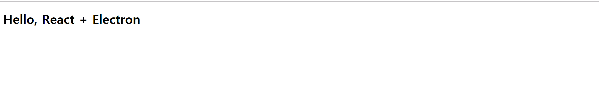
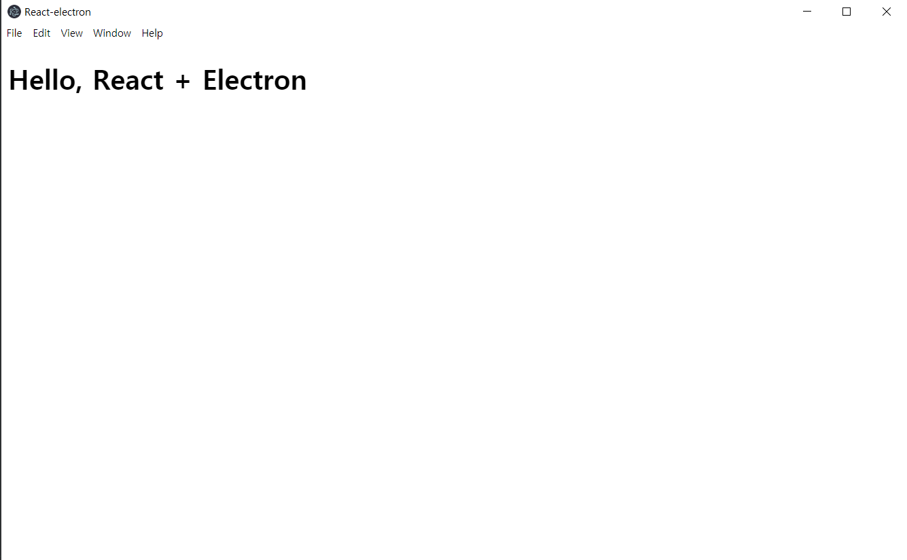

# React + Webpack + Electron 프로젝트 생성하기

---
```
Q : 왜 React + Webpack + Electrone 프로젝트가 필요했을까?
A : 개발 효율은 높이고 성능은 강력한 소프트웨어를 제작하기 위해 다음과 같은 구조의 프로젝트를 기획했습니다!
```
---

Digo 서비스를 기획하면서 서버에서도 개인 PC에서도 설치하여 자동화 시킬 수 있는 인공지능 툴을 개발하고자 했습니다.
그래서 Web, JavaScript기반으로 가벼운 GUI서비스를 제작하려고 결정했습니다. 
<br/>

### 1. Electron이란?
---
Electron은 웹기반의 소프트웨어를 단독 프로그램으로 사용할 수 있도록 만드는 플러그인입니다. Chrome기반으로 만들어져 있으면서
개발자가 설정한 페이지만을 View에 그려줍니다. 서버에서 받아올수도 있지만 로컬에 있는 웹 프로젝트를 단독으로 실행 시킬 수 있는
고마운 플러그인입니다.
<br/>
<div style="width:150px; height:150px; margin-left:auto; margin-right:auto;">
    
</div>
<br/>

### 2. 이런 프로젝트 구성 이유
---
Electron을 사용하려면 위에서 말했던것과 같이 Web URL이나 로컬의 html기반의 파일을 연결시켜줘야 합니다. 클라우드가 아닌
로컬기반의 프로젝트인 Digo에 적용시키기 위해서는 단독 html 콘텐츠가 필요했는데 여기서 첫번째 이슈가 발생하게 되었습니다.
<br/><br/>
저희가 사용중인 Web 프레임워크는 React로 Node기반으로 작동하기 때문이죠.... 그래서 이런 이슈를 해결하기위해 또 다른 강력한
플러그인인 Webpack을 도입시키기로 결정한 것입니다.
<br/><br/>
이러한 고민끝에 React로 프로그램을 작성하고 Webpack으로 독자적으로 작동할 수 있도록 리팩토리작업을 수행한 다음 Electron으로 묶어서
Digo를 단독 어플리케이션으로 제작하는 구조를 도입하게 되었습니다.


### 3. 리엑트 세팅

---

저희는 프로젝트를 구성하면서 다음과 같이 4단계를 거쳐 진행했습니다
1. 리엑트 세팅
2. Webpack 세팅
3. Webpack으로 빌드
4. Electron으로 리빌드

[다음 게시글](https://velog.io/@jeff0720/React-%EA%B0%9C%EB%B0%9C-%ED%99%98%EA%B2%BD%EC%9D%84-%EA%B5%AC%EC%B6%95%ED%95%98%EB%A9%B4%EC%84%9C-%EB%B0%B0%EC%9A%B0%EB%8A%94-Webpack-%EA%B8%B0%EC%B4%88)를 참조했습니다


### 3.1 리엑트 세팅
---

가장 먼저 수행해야하는 작업은 리엑트의 기본적인 세팅을 진행하는 것입니다. 프로젝트에 React를 설치하고 기본 프로젝트 꼴을 설정해야
합니다. node.js를 설치한 후 npm이나 npx (또는 yarn)으로 간단하게 React App을 구성합니다.(해당 글은 npx와 yarn을 사용했습니다.)

```bash
npx create-react-app [App 이름]
```

**위와 같은 bash 명령어로 간단하게 React App을 설치해도 되지만 자유로운 구조 설계를 위해 빈폴더에 작업을 진행했습니다.**

빈폴더에서 
```bash
yarn -y init
```
을 이용하여 폴더를 node프로젝트로 설정합니다.

```bash
yarn add -D @babel/core @babel/preset-env @babel/preset-react babel-loader clean-webpack-plugin css-loader html-loader html-webpack-plugin mini-css-extract-plugin node-sass react react-dom sass-loader style-loader webpack webpack-cli webpack-dev-server
```
명령어를 입력하여 babel 프리셋(빌드 세팅)들과 Wepback, React 보조 플러그인들을 프로젝트에 추가합니다.
<br/><br/>


### 3.2 Webpack 세팅
---
package.json폴더를 열어 Webpack빌드 세팅을 Script에 추가합니다.
```json
{
  "name": "react-electron",
  "version": "1.0.0",
  "main": "index.js",
  "license": "MIT",
  "scripts": {
    "build" : "webpack"
  }, 
  "devDependencies": {
    "@babel/core": "^7.7.2",
    "@babel/preset-env": "^7.7.1",
    "@babel/preset-react": "^7.7.0",
    "babel-loader": "^8.0.6",
    "clean-webpack-plugin": "^3.0.0",
    "css-loader": "^3.2.0",
    "html-loader": "^0.5.5",
    "html-webpack-plugin": "^3.2.0",
    "mini-css-extract-plugin": "^0.8.0",
    "node-sass": "^4.13.0",
    "react": "^16.12.0",
    "react-dom": "^16.12.0",
    "sass-loader": "^8.0.0",
    "style-loader": "^1.0.0",
    "webpack": "^4.41.2",
    "webpack-cli": "^3.3.10",
    "webpack-dev-server": "^3.9.0"
  }
}
```

그 다음 루트 폴더에 webpack.config.js를 생성하여 다음과 같이 빌드 설정을 진행합니다.
```javascript
const path = require("path");
const HtmlWebPackPlugin = require("html-webpack-plugin");

module.exports = {
  entry: "./src/index.js", //빌드할 javascript 파일
  output: {
    filename: "bundle.js", //변환한 javascript 파일
    path: path.resolve(__dirname + "/build_contents") // output 결과물 빌드 위치
  },
  mode: "none",
  module: {
    rules: [ //각각 javascript, html, css 빌드할 규칙
        {
            test: /\.(js|jsx)$/,
            exclude: "/node_modules",
            use: ['babel-loader'],
        },
        {
            test: /\.html$/,
            use: [  
                {
                loader: "html-loader",
                options: { minimize: true } //코드 용량을 최소화 할 것인가?
                }
            ]
        },
        {
            test: /\.css$/,
            use: ['css-loader']
        }
    ]
  },
  plugins: [
    new HtmlWebPackPlugin({
        template: './public/index.html',
        filename: 'index.html'
    })
  ]
};
```
src폴더와 public폴더를 각각 생성한후 src에는 index.js, public에는 index.html파일을 각각 생성해준 다음과 같이 작성합니다.

```html
<!-- index.html -->
<!DOCTYPE html>
<html lang="kr">
  <head>
    <meta charset="utf-8" />
    <title>React-electron</title>
  </head>
  <body>
    <div id="root"></div>
  </body>
</html>
```

```javascript
// index.js
import React from "react";
import ReactDOM from "react-dom";

function Root(){
    return(
        <h1>Hello, React + Electron</h1>
    )
}
ReactDOM.render(<Root />, document.getElementById("root"));
```

바벨을 이용하여 리엑트와 각종 js코드를 ES6에서 ES5로 묶어주는 세팅을 진행해야 합니다. 루트 폴더에 ".babelrc"파일을 생성해준후 다음과 같이 세팅합니다.

```json
{
    "presets": ["@babel/preset-env", "@babel/preset-react"]
}
```

여기까지 완료되었다면 잘 작동하는지 확인해보겠습니다.

### 3.3 Webpack 빌드
---
```bash
yarn build
```
를 이용하여 빌드를 진행하고 /build-contents/index.html을 브라우져에서 실행하면

<br/><br/>

<br/><br/>

다음과 같이 확인이 가능합니다. 이제 일렉트론과 빌더를 설치합니다

```bash
yarn add -D electron electron-builder
```

### 3.4 Electron 빌드
---
package.json파일에 main 추가하고 scripts에 다음과 같이 start를 추가합니다.
```json
"main" : "public/main.js",
"scripts" : {
	"build" : "webpack",
	"start" : "webpack && electron ." 
}
```

public폴더에 main.js를 생성후 다음과 같이 작성합니다. Electron을 설정하고 실행시키기 위한 javascript파일입니다.

```javascript
const electron = require('electron');
const {app, BrowserWindow} = electron;
const path = require('path');
const url = require('url');

let mainWindow;

//어플리케이션 기동이 종료 후 동작한다.
app.on('ready', () => {
    createWindow();
});

function createWindow() {
    mainWindow = new BrowserWindow({
        width: 1350,
        height: 800,
        useContentSize: true,
        title: 'Digo'
    });

    mainWindow.loadFile('./build_contents/index.html');

    //윈도우 전부를 닫고, null로 지정한다.
    mainWindow.on('closed', () => {
        mainWindow = null
    });
}
```

다음 명령어를 이용하여 React 빌드 및 Electron을 실행시킬 수 있습니다.
```bash
yarn start
```

<br/><br/>


### 4. 실행된 결과 화면

