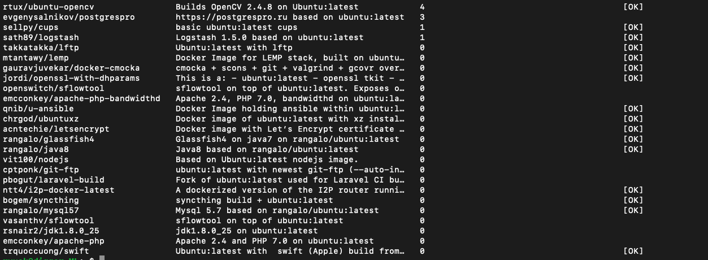
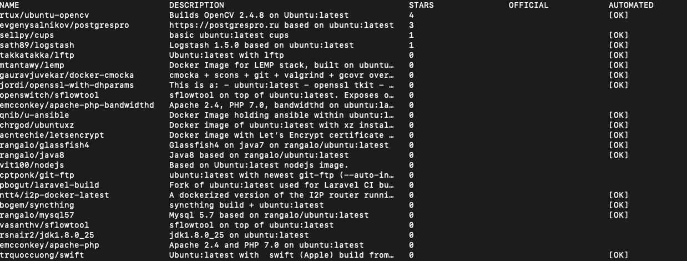
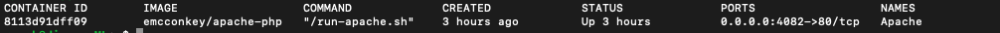
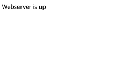
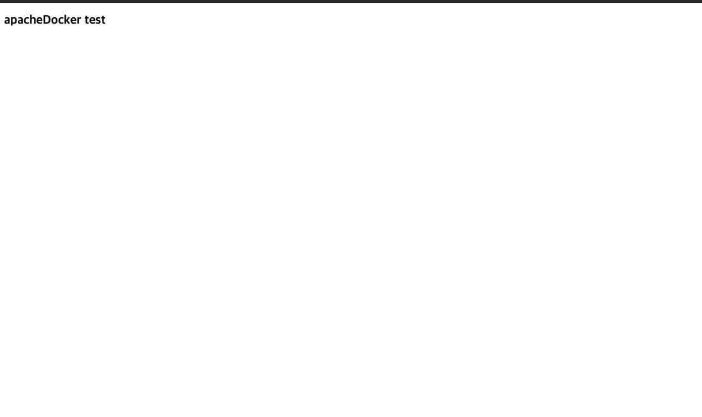

**육승남**
# Docker(도커)를 처음 사용하는 방법
---


```
Q: 도커를 사용하는 이유는 무엇인가요?
A: 프로그램의 실행환경이나 개발환경을 고려하지 않고 원하는 기능을 이용할 수 있기 때문에 사용합니다!
```
디거에서는 서버에서 실행해야 하거나 자체적으로 작동시켜야 하는 소프트웨어를 도커를 통해 진행하는 것을 권장합니다.
환경세팅에 필요한 시간을 줄이고 동일한 세팅에서 개발할 수 있도록 하기 위해서입니다.

### 1. Docker 이미지 검색
---
Docker 이미지는 [Docker 허브](https://hub.docker.com/)에 저장되어 있는데 docker search [사용하고자 하는 라이브러리 이름] 형식으로 검색할 수 있습니다.  

```bash
$ docker search ubuntu
```
위 명령어를 실행하면 



그림과 같이 ubuntu와 관련되는 이미지들의 리스트를 확인할 수 있습니다.
<br/><br/>

[사용하고자 하는 라이브러리 이름]는 라이브러리의 이름과 Tag로 구성되어 있습니다. Tag를 통해 자신이 사용하고자 하는 버전을 검색할 수 있습니다. 
```bash
$ docker search ubuntu:latest
```
위 명령어와 같이 ubuntu뒤에 있는:latest 가 태그 입니다. 태그를 사용하면 그 버전에 관해서만 검색할 수 있습니다. 



### 2. Docker 이미지 받기
---

Docker 이미지를  받기 위해서는 pull명령어를 사용하는데pull 명령어를 사용해 이미지를 받습니다. 
```bash
$ docker pull emcconkey/apache-php
```
검색결과 가운데서 스타가 가장 많은 docker pull edse/ubuntu-nginx-mysql-php-nodejs 이미지를 다운 받았습니다. Docker의 pull과정은 일반 software를 자신의 컴퓨터에 다운로드 하는 과정과 비슷합니다. 

### 3. 이미지 실행하기 

Docker 이미지를 사용하려면 run 명령어를 사용하여 컨테이너를 만들어야 합니다. 이미지와 컨테이너는 software의 설치파일과 실행파일에 해당하다고 볼 수 있습니다.

```bash
$ docker run -itd -p 4082:80 -v /home/ryuck/Test/:/ApacheTest:rw --name Apache emcconkey/apache-php
```

#### 자주 쓰는docker -run  옵션들

- -i: interactive의 약자로써 표준입력을 진행할 수 있습니다.
- -t: tty모드(가상의 tty) bash를 사용할때 사용합니다. tty가 없으면 명령을 입력할수 있지만 셀이 보이지 않습니다.
- -d: 흔히 데몬 모드라고 부르며 컨테이너가 백그라운드로 돌 수 있습니다.
- -v: volume의 약칭입니다. 호스트 볼륨:도커내 볼륨 으로 정의 합니다. 도커내 볼륨은 절대 경로로 쓰고 :rw 는 읽기 쓰기 권한을 추가 하는 기능입니다.
- -p: 포트의 약칭입니다.  -p 4082:80은 호스트의 4082 포트와 도커내부의 80포트를 바인딩 시키는 작업을 가리킵니다.
- --name: 를 통해 컨테이너의 이름을 지정해 줍니다.


docker ps명령어를 통해 실행되고 있는 컨테이너를 볼수 있습니다. 

```bash
$ docker ps
```


그림과 같이 ps 명령어를 통해 이미지 이름 실행되는 쉘 시간 상태 포트 이름 등 정보를 확인할 수 있습니다. 

### 4. 결과 확인  

```bash
$ docker start Apache
```

start 명령어를 통해  아파치 컨테이커를 실행합니다.  웹 브라우저에 호스트 주소:4082를 입력하면 서버가 잘 작동하고 있음을 알 수 있습니다. 



호스트에 있던 html파일을 도커로 옯겨 보겟습니다. 

```bash
$ docker exec Apache cp ./ApacheTest/test.html /var/www/html
```
- 호스트와 공유 되여 있는 ApacheTest폴더로부터 test.html 파일을 도커에 있는 /var/www/html폴더로 옮겨 놓았습니다.
- 웹 브라우저에 호스트 주소:4082/test.html을 입력해 봅니다. html이 잘 작동 됩니다.


