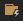

**임현**
# Azure Function 입문자를 위한 사용법

```
Q: Azure Functions는 무엇인가요?
A: 물리적인 서버나 관리없이 서버기능을 사용할 수 있도록 하는 클라우드 서비스입니다!
```

서버의 보안이나 특수 이슈를 해결하기 위한 서버팀이 없는 소규모 개발팀에게 매우 고마운 존재입니다. 서버 기능을 담은 코드만 입력하면
서버를 사용할 수 있도록 제공하기 때문입니다. 저희는 디고 개발을 위해 Azure Functions의 기능 일부를 사용하고 있습니다. Azure Functions를 처음 사용하시는
분들을 위해 환경세팅법을 소개해 드리겠습니다.

# 1.환경 설정하기

- Visual Studio Code를 설치 [https://code.visualstudio.com/](https://code.visualstudio.com/)
- Visual Studio Code의 Extensions에서 Azure Functions를 설치
- NPM 설치

#### V2 설치법
```bash
$ npm i -g azure-functions-core-tools@2 --unsafe-perm true
```

#### V3 설치법
```bash
$ npm i -g azure-functions-core-tools@3 --unsafe-perm true
```

# 2.새로운 프로젝트 생성하기
---

1. 가장 먼저 Vsual Studio Code에서 마이크로소프트 계정으로 로그인을 진행해야합니다.
```
단축키 ctrl+shift+p를 입력하여 Sign In 명령을 실행 합니다.
```
2. Create New Project 버튼을 클릭하여 새로운 프로젝트를 생성합니다.

3. 개발하기 원하는 언어를 선택합니다. (ex. Python, Java, C# 등)
4. 함수 작동 원리를 선택합니다. (Function Template)
5. 프로젝트에 새로운 함수를 추가하기 위해서 다음 버튼을 클릭하여 생성합니다.


# 3.테스트 진행하기
---

1. 처음 추가하여 자동으로 생성된 코드를 실행합니다. (단축키 : F5)
2. func.ps1 cannot be loaded 에러가 나타나면 Visual Studio Code 컴맨드창에 아래 명령을 실행합니다.

```bash
$ Set-ExecutionPolicy -Scope CurrentUser -ExecutionPolicy Unrestricted
```

# 4. 서버에 업데이트
---

- Local에서 개발한 기능을 서버에 올리려고 할 경우 다음버튼을 클릭하면 업데이트 할 수 있습니다.
